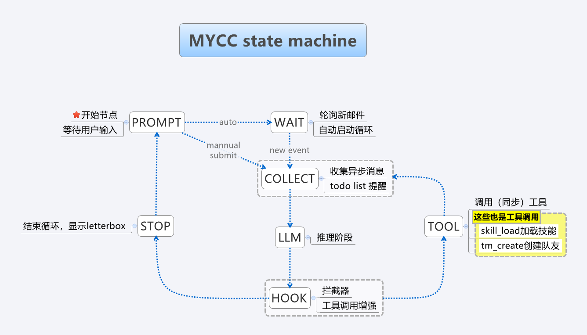

# Agent Loop State Machine

## Motivation

The agent loop was refactored from an imperative `while(true)` into a state machine. Each step is now an isolated handler connected by explicit transitions. The user prompt is a first-class state, enabling autonomous operation by swapping the input provider.

The original `src/loop/agent-loop.ts` has been removed; the state machine in `src/loop/state-machine.ts` is the sole implementation.

## The 8 States



| State | Responsibility | Source |
|-------|---------------|--------|
| **prompt** | Get user input (or skip in autonomous mode). Handle `/slash`, `!bang`, multi-line, exit. Display letter box on turn completion. **Auto-mode engagement gate**: redirect to `wait` when (1) auto mode is already on, or (2) an autofly trigger (`--debug-autofly` flag OR an active peer channel via `ctx.peer.hasActiveChannel()`) is armed and the streak of consecutive successful LLM stages within the current turn exceeds the threshold (`--autofly=N`, default 3). In case 2, `setAuto(true)` is called first so subsequent loops take path 1. Also handles: wrap-up commit/rollback, steering note synthesis (webui), file upload drain (webui), keyword extraction for skill discovery. | `src/loop/states/prompt.ts` |
| **slash** | Execute slash commands (e.g., `/team`, `/load`, `/help`). Bidirectional with PROMPT: PROMPT detects `/`, routes to SLASH, SLASH executes and returns to PROMPT. When a command sets `nextQuery` (e.g., `/load`), it is stored on `env.pendingSlashQuery` for the PROMPT handler to consume. | `src/loop/states/slash.ts` |
| **collect** | Pre-LLM pipeline: child questions, mail collection, team status injection, steering queue drain (webui), file upload drain (webui), hint round (confusion ≥ 10), todo nudging (with peer channel state + pinned todo reactivation), brief nudging, worktree cleanup nudge, skill discovery from extracted keywords. | `src/loop/states/collect.ts` |
| **llm** | Auto-compact (proactive via `needsCompact()` or deferred via `pass.deferredCompact`). Build system prompt, call `retryChat` with internal retry loop, handle abort. Crossroad detection (turning words → truncate + generate alternative continuation). Records a successful LLM stage (`recordLlmSuccess()` increments the streak — a pure counter; it does NOT engage auto mode). | `src/loop/states/llm.ts` |
| **hook** | Augment tool calls with metadata. Evaluate hook conditions. Inject, replace, or block tool calls. Handle meta-tools (checkpoint, recap). Crossroad continuation injection. Handle deferred compact requests (sets `pass.deferredCompact`, actual compact runs at LLM stage). Branch to `tool` or `stop`. | `src/loop/states/hook.ts` |
| **tool** | Execute tool calls sequentially. Handle ESC interruption, hook blocking, sequence tracking, ResultTooLargeError, confusion scoring (semantic duplication via embedding similarity, error results), keyword extraction from brief messages. | `src/loop/states/tool.ts` |
| **stop** | Handle the no-tool-call case. Neglected mode wrap-up (ESC during LLM → display final response, exit auto mode if on). Await teammates (if any). Always transitions to `prompt` — PROMPT is the single decision point for the auto-redirect. | `src/loop/states/stop.ts` |
| **wait** | Autonomous-mode block. Replaces prompting when auto mode is on. Blocks for an external event — new mail, a teammate state change (holding/working), or a webui steering note — then transitions to `collect`. ESC (or a programmatic `setAuto(false)`) exits auto mode and returns to `prompt`. Polls every 1s. | `src/loop/states/wait.ts` |

## Data Tiers

Three tiers with distinct lifetimes (`src/loop/state-machine.ts`):

| Tier | Reset on | Contains |
|------|----------|----------|
| `MachineEnv` | never | `triologue`, `ctx` (AgentContext), `scope`, `conditions`, `sequence`, `hookExecutor`, `inputProvider`, `sessionFilePath`, `pendingSlashQuery`, `crossroadOccurred`, `requestEmbeddingTracker`, `nextWtNudge` |
| `TurnVars` | entering **prompt** or **wait** (from STOP/startup, not from SLASH) | `isFirstRound`, `nextTodoNudge` (init 3), `lastTodoState`, `nextBriefNudge` (init 5), `lastUserQuery`, `extractedKeywords` |
| `PassData` | entering **collect** | `abortController`, `rawToolCalls`, `assistantContent`, `assistantReasoningContent`, `augmentedCalls`, `hookResult`, `crossroadContinuation`, `deferredCompact` |

Handler signature:

```typescript
type StateHandler = (
  env: MachineEnv,
  turn: TurnVars,
  pass: PassData
) => Promise<AgentState | null>;  // null = machine exit
```

## Transition Table

| From | Condition | To |
|------|-----------|-----|
| startup | always | prompt (initial state; PROMPT redirects to `wait` if auto is on) |
| prompt | auto mode on | wait |
| prompt | autofly trigger on && streak ≥ threshold | wait (after `setAuto(true)`) |
| prompt | peer channel joins mid-prompt (PromptAbortError) | wait |
| prompt | got input | collect |
| prompt | user typed exit/quit | null (machine returns) |
| prompt | input is `!bang` | prompt (after hand_over execution) |
| prompt | input is `/slash` | slash |
| slash | command executed | prompt (preserves TurnVars) |
| collect | preflight done | llm |
| collect | ESC during hint generation | prompt |
| llm | response received (has content or tool calls) | hook |
| llm | aborted (ESC) | prompt |
| llm | transient error + user retries | llm (stay) |
| llm | transient error + user declines | prompt |
| llm | empty output retries exhausted (>3) | prompt |
| hook | has surviving tool calls | tool |
| hook | no calls (all blocked or LLM produced none) | stop |
| hook | compact requested (deferred) | collect |
| hook | checkpoint/recap meta-tool | collect |
| hook | crossroad continuation | collect |
| tool | all executed | collect |
| tool | ESC interrupt | prompt |
| stop | got question / new mail | collect |
| stop | timeout | collect |
| stop | all done / no teammates | prompt (always — PROMPT decides the auto-redirect) |
| wait | event arrived (mail / teammate / steering) | collect |
| wait | ESC / programmatic auto-off | prompt |

## Error Handling

Three tiers:

**Tier 1: retryChat** — 3x backoff retry for transient errors. Abort short-circuits immediately.

**Tier 2: State handlers** — each handler owns its error domain and catches errors internally, returning to a safe state (typically PROMPT) rather than throwing:

- **llm**: ESC → start wrap-up → prompt. Transient error → `inputProvider.promptRetry()` → retry or prompt. Empty output → inject synthetic brief() and retry (up to 3x), then prompt.
- **hook**: errors → brief('error') → prompt.
- **tool**: `ResultTooLargeError` → truncate output to preview + save full content to file. ESC → skip remaining tools → prompt. Other tool errors → log as tool result, increase confusion, continue to next tool.
- **collect**: errors → brief('error') → prompt.
- **stop**: errors → brief('error') → prompt.

**Tier 3: agent-repl.ts main()** — catch-all for ShutdownError, readline closed, and fatal errors with `classifyError()` guidance.

### Retry Consolidation

The old REPL's retry loop (wrapping entire `agentLoop()`) merged into the **llm** state. When `retryChat` exhausts internal retries, the llm state calls `inputProvider.promptRetry()` inline instead of bubbling up to a separate loop. On retry, the llm call restarts immediately — no redundant preflight work.

## Input Provider Abstraction

```typescript
interface InputProvider {
  readonly name: string;
  getInput(initialContent?: string): Promise<string | null>;  // null = skip prompt (autonomous)
  promptRetry(errorMessage: string): Promise<boolean>;
}
```

| Implementation | `getInput()` | `promptRetry()` | Source |
|----------------|-------------|-----------------|--------|
| `UserInputProvider` | `agentIO.ask()` | Shows "Retry? [Y/n]" | `src/loop/input-provider.ts` |
| `WebInputProvider` | WebSocket-based (webui) | Delegates to UserInputProvider | `src/serve/web-input-provider.ts` |

`agent-repl.ts` selects `WebInputProvider` when the serve hub is running, otherwise `UserInputProvider`.

## File Layout

```
src/loop/state-machine.ts       — AgentState enum, MachineEnv/TurnVars/PassData, AgentStateMachine runner
src/loop/input-provider.ts      — InputProvider interface + UserInputProvider
src/loop/auto-state.ts          — AutoState singleton (auto flag, streak counter, autofly threshold)
src/loop/loop-events.ts         — Observability event emitter (state_transition, compact_triggered, etc.)
src/loop/states/prompt.ts       — handlePrompt (incl. auto-mode engagement gate, steering synthesis)
src/loop/states/slash.ts        — handleSlash (slash command routing)
src/loop/states/collect.ts      — handleCollect
src/loop/states/llm.ts          — handleLlm
src/loop/states/hook.ts         — handleHook
src/loop/states/tool.ts         — handleTool
src/loop/states/stop.ts         — handleStop (always → PROMPT)
src/loop/states/wait.ts         — handleWait (autonomous-mode block)
```

`src/loop/agent-repl.ts` is the thin wrapper: init → AgentStateMachine → run → error display.

## Feature Mapping

| Feature | State | Source |
|---------|-------|--------|
| ask() + slash/bang/exit | prompt | `prompt.ts` |
| displayLetterBox | prompt (via `presentResult()` in stop) | `state-machine.ts` |
| retry loop | llm (merged with retryChat retries) | `llm.ts` |
| handlePendingQuestions | collect | `collect.ts` |
| collectMails | collect | `collect.ts` |
| team status injection | collect | `collect.ts` |
| steering / file upload drain (webui) | collect + prompt | `collect.ts`, `prompt.ts` |
| hint round | collect | `collect.ts` |
| todo nudging + peer channels + reactivation | collect | `collect.ts` |
| brief nudging | collect | `collect.ts` |
| worktree cleanup nudge | collect | `collect.ts` |
| skill discovery (keyword matching) | collect | `collect.ts` |
| buildSystemPrompt + retryChat | llm | `llm.ts` |
| auto-compact (proactive + deferred) | llm | `llm.ts` |
| crossroad detection | llm | `llm.ts`, `crossroad.ts` |
| augmentToolCalls + processToolCalls | hook | `hook.ts` |
| blocked call handling | hook | `hook.ts` |
| checkpoint / recap meta-tools | hook | `hook.ts`, `checkpoint-recap.ts` |
| no-tool branching | hook (→ tool or stop) | `hook.ts` |
| tool execution loop | tool | `tool.ts` |
| deferred messages | tool | `tool.ts` |
| confusion scoring (semantic duplication) | tool | `tool.ts` |
| awaitTeam + timeout | stop | `stop.ts` |
| neglected wrap-up | stop | `stop.ts` |
| auto-mode block | wait | `wait.ts` |